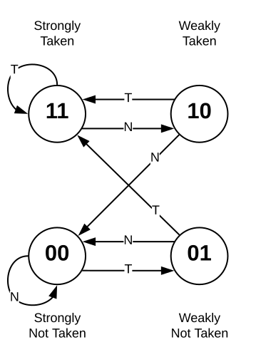
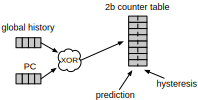

# Branch Prediction

In this lab, you will need to modify the existing [branch predictor](https://github.com/openhwgroup/cva6/blob/b44a696bbead23dafb068037eff00a90689d4faf/core/frontend/bht.sv). See the [Your Own Repository Guide](../guides/your-own-repo.md) for our recommended way to organize and collaborate on labs.

## Pre-Lab Questions

1. Define, compare, and contrast the following:
    * Static branch prediction
    * Dynamic branch prediction
    * One-level branch prediction
    * Two-level predictor
    * Local branch prediction
    * Global branch prediction
2. Define BHT, BTB and RAS. What are they used for?
3. Look at [frontend.sv](https://github.com/openhwgroup/cva6/blob/b44a696bbead23dafb068037eff00a90689d4faf/core/frontend/frontend.sv). What are the 4 types of instructions that the branch predictor handles, and how are they handled?
4. How is a branch resolution handled?
5. What kind of dynamic branch predictor does CVA6 use?
6. Provide a GitHub permalink to where in `ariane_pkg` the branch predictor structs are defined.
7. When can more than 1 instruction be fetched per cycle?

## Part 1 - CVA6 Predictor

Add functionality to [frontend.sv](https://github.com/openhwgroup/cva6/blob/b44a696bbead23dafb068037eff00a90689d4faf/core/frontend/frontend.sv) that records the branch predictor hit-rate.

To do this, you can create an `always_ff @(posedge clk)` block that counts how many times [is_mispredict](https://github.com/openhwgroup/cva6/blob/b44a696bbead23dafb068037eff00a90689d4faf/core/frontend/frontend.sv#L248) is true, and how many times the current instruction is a [branch](https://github.com/openhwgroup/cva6/blob/b44a696bbead23dafb068037eff00a90689d4faf/core/frontend/frontend.sv#L222). The hit-rate can be calculated with 1-num_mispredicts/num_branches. You can then record the hit-rate to a file on every clock cycle; this way, you are certain to get the final hit-rate when the simulation terminates.

### Part 1 Questions

1. Highlight your changes to `"frontend.sv"` that records the hit-rate.
2. What are the final hit-rate percentages of each of the [bp benchmarks](https://github.com/sifferman/labs-with-cva6/tree/main/programs/bp)?
3. Compare the performance of the [bp benchmarks](https://github.com/sifferman/labs-with-cva6/tree/main/programs/bp) after choosing 3 new values for [`NR_ENTRIES`](https://github.com/openhwgroup/cva6/blob/b44a696bbead23dafb068037eff00a90689d4faf/core/frontend/frontend.sv#L419). Display the hit-rates in a table and explain your findings.

### Example of How to Write to a File in Verilog/SystemVerilog

```systemverilog
integer f;
integer counter;
initial begin
    f = $fopen("bp.txt","w");
end
always @(posedge clk) begin
    $fwrite(f, "%f\n", $bitstoreal(counter));
end
```

## Part 2 - Global Predictor

In this part, you will modify the [bht.sv](https://github.com/openhwgroup/cva6/blob/b44a696bbead23dafb068037eff00a90689d4faf/core/frontend/bht.sv) and turn it into a [global two-level adaptive branch predictor](https://en.wikipedia.org/wiki/Branch_predictor#Global_branch_prediction). First, read through the [Global Branch Predictor Specifications](#global-branch-predictor-specifications) section.

A few notes on your implementation:

* Choose your own values for `n` and `m`
* You can use whatever algorithm you want to calculate the BHT index
    * You can use Gshare or Gselect
    * You may also choose to use [XORShift](https://en.wikipedia.org/wiki/Xorshift), a simple random-number-generation algorithm, to create a hash that will index into your BHT
* Be sure that your BHT size is decided by the parameter `NR_ENTRIES`
* Be sure to remove all unused lines of code leftover from the initial implementation
* Be sure to comment your design clearly

### Part 2 Questions

1. Share your modified `"bht.sv"` that implements the global two-level adaptive branch predictor.
2. What specifications did you decide on for your predictor? What is your BHT index generation algorithm? How wide is your GHR? Which address bits do you use for your address?
3. Briefly explain your reasoning behind the BHT index generation algorithm you chose.
4. Compare the performance of the [bp benchmarks](https://github.com/sifferman/labs-with-cva6/tree/main/programs/bp) for 3 different values of `NR_ENTRIES`. Display the hit-rates in a table and explain your findings.

## Global Branch Predictor Specifications

*This section describes the specifications required to build a global two-level adaptive branch predictor.*

For global branch predictors, a global history record (GHR) must be kept. A GHR keeps a record of the past `n` branches using a FIFO method. To maintain the GHR, when a branch has been resolved, the branch result must be shifted into the GHR while simultaneously dropping the `n`th result.

Similar to a one-level branch predictor, a two-level branch predictor contains a branch history table (BHT) where its entries are (*often*) two-bit saturation counters. However, one-level and two-level predictors differ in how the BHT index is calculated.

For a global two-level adaptive branch predictor, the BHT index is calculated using the current GHR value and using `m` bits from the resolved branch's program counter. The GHR and PC can either be concatenated together (called Gselect) or xor'ed together (called Gshare). Other BHT index calculation algorithms exist but have little effect on the predictor performance.

### 2-Bit Saturation Counter

[](https://docs.boom-core.org/en/latest/sections/branch-prediction/backing-predictor.html#the-two-bit-counter-tables)

### Gshare Predictor

[](https://docs.boom-core.org/en/latest/sections/branch-prediction/backing-predictor.html#the-two-bit-counter-tables)

## Extra Credit

Branches come in many patterns in real code, and it is not uncommon to find that different styles of branch prediction have value in different situations. Extend your predictor to contain a "Tournament" of CVA6's predictor and your global predictor, with a sensible mechanism for updating trust based on successful or failed predictions.

## Code Submission

Submit to the Gradescope Autograder your modified `"bht.sv"` that implements a global two-level adaptive branch predictor. The autograder will verify the hit-rate for several different programs, but your implementation will be verified manually.
