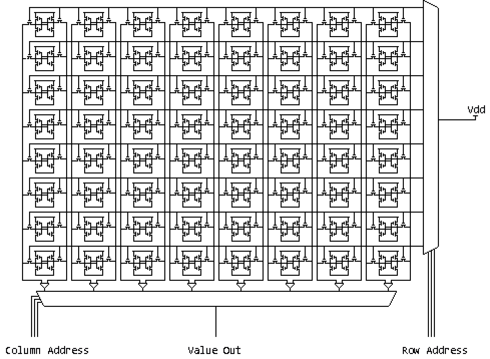

# Caching

In this lab, you will add a victim cache to the [CVA6 I-Cache](https://github.com/openhwgroup/cva6/blob/master/core/cache_subsystem/cva6_icache.sv).

## Pre-Lab Questions

### Verilog/SystemVerilog Questions

1. For the following questions, please provide a screenshot from [DigitalJS Online](https://digitaljs.tilk.eu/), a Verilog synthesis visualizer, to support your answers.
    1. How is a Verilog/SystemVerilog `for` loop synthesized?
    2. How is a Verilog/SystemVerilog `if` statement synthesized?
2. CVA6 uses a common design practice of appending `_d` and `_q` to the end of net names. What does each mean? How should each net type be assigned? Why can this practice be more useful than using a single net?
3. When synthesizing Verilog/SystemVerilog into a netlist, the synthesis tool will often "infer" where you have created a block-RAM and try to optimize the design accordingly. This is extremely helpful if your target FPGA or ASIC already has built-in block-RAMs, because using the built-in block-RAMs will be much more power and area efficient than creating an equivalent design using flip-flops. For example, you can see that [DigitalJS Online](https://digitaljs.tilk.eu/) converts the Verilog array into a "RAM" logic cell.

   ```systemverilog
   module ram (
      input clk,
      input rst,
      // read port
      input [1:0] raddr_i,
      output [7:0] rdata_o,
      // write port
      input [1:0] waddr_i,
      input [7:0] wdata_i,
      input we_i
   );

   logic [7:0] RAM [0:3];

   assign rdata_o = RAM[raddr_i];

   always_ff @(posedge clk) begin
      if (we_i) RAM[waddr_i] <= wdata_i;
   end

   endmodule
   ```

   1. Add a `for` loop to this design so that when `rst` goes high, all the RAM cells' values are set to `'0` on the next clock cycle. Provide your modified code and a screenshot of what [DigitalJS Online](https://digitaljs.tilk.eu/) synthesized.
   2. Why is this reset strategy not scalable to larger RAM sizes? Theorize a better strategy to reset the RAM assuming that minimizing die area is much more important than execution time?

### Cache Questions

1. What is the purpose of a cache?
2. What is the purpose of a L1, L2, and L3 cache?
3. For the following questions, assume you have a CPU operating at 3.6 GHz.
    1. How many CPU clock cycles are needed to read from a DDR5-4800 CL40? (Assume a total latency of 16.67ns)
    2. How many CPU clock cycles are needed to read from an SSD over NVMe? (Assume a total latency of 10&mu;s)
    3. How many CPU clock cycles are needed to read from an SSD over SATA? (Assume a total latency of 70&mu;s)
    4. How many CPU clock cycles are needed to read from an HDD over SATA? (Assume a total latency of 10ms)
4. Caches are designed using SRAM. What are the pros and cons of using SRAM instead of DRAM or flip-flops for caches?
5. Provided is a circuit diagram of an SRAM cell and SRAM array. (BL - Bit Line, WL - Word Line, Q - data) Use them to give a 1-sentence response for each of the following questions:
    [](https://en.wikipedia.org/wiki/Static_random-access_memory)
    [](http://www.barth-dev.de/knowledge-corner/digital-design/memory-array-architectures/)
    1. How is a bit read from an SRAM cell?
    2. How is a bit written to an SRAM cell?
    3. How is a word read from an SRAM array?
    4. How is a word written to an SRAM array?
6. What is the purpose of a Victim Cache? When is it written to and read from?

## Part 1

In this part, you will finish an implementation of a Victim Cache.

The implementation should be a fully-associative cache with LRU replacement policy. It should have support for any positive integer cache size, meaning that the LRU algorithm will change a bit depending on the specified size. For a cache size of 1, there is no LRU logic necessary because only one way can be replaced. For a cache size of 2, there should be a single bit specifying which way was least recently accessed, and therefore which way should be replaced. For a cache size >2, there should be a doubly-linked-list (DLL) that orders each way from LRU to MRU; every read/write should bump the corresponding way to the MRU of the DLL, and every write should replace the LRU of the DLL.

The module you need to finish is [`"ucsbece154b_victim_cache.sv"`](https://github.com/sifferman/labs-with-cva6/blob/main/labs/caching/starter/ucsbece154b_victim_cache.sv), found in [`"labs/caching/starter"`](https://github.com/sifferman/labs-with-cva6/tree/main/labs/caching/starter). Your job will be to fix all the lines labeled `// TODO`. You can simulate your changes with ModelSim using `make sim TOOL=modelsim` (or Verilator 5 using `make sim TOOL=verilator` assuming that you have it set up). A [sample testbench](https://github.com/sifferman/labs-with-cva6/blob/main/labs/caching/starter/tb/victim_cache_tb.sv) is provided that you may edit as desired.

## Part 2

In this part, you will change the CVA6 filelist to add your victim cache to the I-Cache. Additionally, you will write a simple assembly program that verifies the I-Cache and MMU work as intended.

### Updates to I-Cache

CVA6's I-Cache is implemented here: [`"cva6/core/cache_subsystem/cva6_icache.sv"`](https://github.com/openhwgroup/cva6/blob/master/core/cache_subsystem/cva6_icache.sv). It is highly parameterizable, allowing you to change the number of entries, the number of ways, and more. A modified version of this implementation is provided to you here, [`"ucsbece154b_icache.sv"`](https://github.com/sifferman/labs-with-cva6/blob/main/labs/caching/part2/ucsbece154b_icache.sv), which calls the victim cache that you created in the previous part.

Try to read through the files and answer the questions below.

### Option `-f <file>`

(Nearly) all Verilog/SystemVerilog tools have the command-line option `-f <file>` which reads the specified file as additional command line arguments. ([Verilator `-f` documentation](https://veripool.org/guide/latest/exe_verilator.html#cmdoption-0)). This is extremely useful and common for providing a list of RTL files, because any files specified will be treated as source files to be compiled. CVA6's [Makefile](https://github.com/openhwgroup/cva6/blob/a63226d8bedcda16709436d932bf5e40c45c9fbe/Makefile#L542) calls `-f` on [`"cva6/core/Flist.cva6"`](https://github.com/openhwgroup/cva6/blob/master/core/Flist.cva6).

Modify [`"cva6/core/Flist.cva6"`](https://github.com/openhwgroup/cva6/blob/master/core/Flist.cva6) by removing the file [`"cva6/cache_subsystem/cva6_icache.sv"`](https://github.com/openhwgroup/cva6/blob/master/core/cache_subsystem/cva6_icache.sv), and adding the files [`"ucsbece154b_icache.sv"`](https://github.com/sifferman/labs-with-cva6/blob/main/labs/caching/part2/ucsbece154b_icache.sv) and [`"ucsbece154b_victim_cache.sv"`](https://github.com/sifferman/labs-with-cva6/blob/main/labs/caching/starter/ucsbece154b_victim_cache.sv). (Be sure that you get the paths correct; feel free to move files as needed.)

### Verify the I-Cache

Write a program that meets the specifications described in the [Part 2 Questions](#part-2-questions). Provided are list of hints to help you:

* The victim cache will only be written to when all the ways of a cache index are full.
* You should jump between multiple instructions with PCs that give the same cache index value.
* You can align instructions to a PC with a power of 2 by prefacing the instruction with the directive `.align <size-log-2>`.
* You can view the instructions and PCs of an ELF file with the following command: `riscv64-unknown-elf-objdump -d <PATH TO PROGRAM>.elf`

### Verify the MMU

Write a program that meets the specifications described in the [Part 2 Questions](#part-2-questions).

RISC-V allows multiple different implementations of virtual memory. By default, CVA6 implements the "sv39" mode. This is what you should use for this lab.

* The RTL for the sv39 MMU is found here: [`"cva6/core/mmu_sv39/"`](https://github.com/openhwgroup/cva6/tree/master/core/mmu_sv39)
* The net hierarchical path to the MMU is `TOP.ariane_testharness.i_ariane.i_cva6.ex_stage_i.lsu_i.gen_mmu_sv39.i_cva6_mmu`.

### Part 2 Questions

1. Using the original CVA6 icache, [`"cva6/cache_subsystem/cva6_icache.sv"`](https://github.com/openhwgroup/cva6/blob/master/core/cache_subsystem/cva6_icache.sv), answer the following questions:
   1. How is the table index calculated?
   2. How is the tag calculated?
   3. Provide a permalink to the logic that causes the core to stall, assuming a miss has occurred and the main memory request hasn't been fulfilled yet.
2. Using the modified icache, [`"ucsbece154b_icache.sv"`](https://github.com/sifferman/labs-with-cva6/blob/main/labs/caching/part2/ucsbece154b_icache.sv), answer the following questions:
   1. When is the victim cache written to?
   2. What occurs in the `VICTIM_HIT` state?
   3. What occurs in the `VICTIM_MISS` state?
3. Show the changes you made to [`"cva6/core/Flist.cva6"`](https://github.com/openhwgroup/cva6/blob/master/core/Flist.cva6).
4. Provide a program that demonstrates the following behaviors of the I$ and victim cache, and provide waveform screenshots of each event.
   1. An I$ miss.
   2. An I$ hit. What value+tag was read?
   3. A write to the victim cache. What value+tag was written?
   4. A victim cache hit. What value+tag was read?
5. What is the purpose of virtual memory?
6. Define the following: MMU, PTW, TLB.
7. ~~Provide a program that demonstrates the following behaviors of the MMU and provide waveform screenshots of each event.~~
   1. ~~2 separate instructions that occur in 2 different frames. For each instruction, observe/calculate the following:~~
      1. ~~What is the virtual address?~~
      2. ~~What is the virtual page number?~~
      3. ~~What is the virtual page offset?~~
      4. ~~What is the physical frame address?~~
      5. ~~What is the physical frame number?~~
      6. ~~What is the physical frame offset?~~
   2. ~~A TLB miss.~~
   3. ~~A TLB hit. Observe/calculate the following:~~
      1. ~~What is the virtual address?~~
      2. ~~What is the virtual page number?~~
      3. ~~What is the physical frame address?~~
      4. ~~What is the physical frame number?~~
