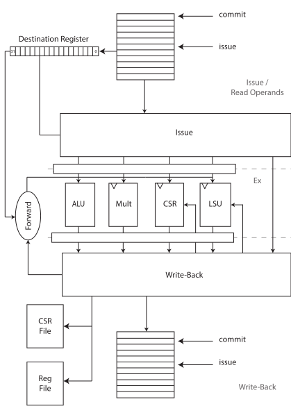

# Out-of-Order

In this lab, you will be asked several questions to verify your understanding of Out-of-Order.

## Prelab

Read through the [CVA6 Execute Stage Documentation](https://docs.openhwgroup.org/projects/cva6-user-manual/03_cva6_design/ex_stage.html) and the [CVA6 Issue Stage Documentation](https://docs.openhwgroup.org/projects/cva6-user-manual/03_cva6_design/issue_stage.html).

1. What is the purpose of Out-of-Order?
2. Give a brief explanation of Scoreboarding and Tomasulo's Algorithm. What are the pros and cons of each? Which OoO strategy does CVA6 use? (Extra: [Tomasulo's original paper](https://ieeexplore.ieee.org/document/5392028))
3. CVA6's rename unit will not be enabled for this lab. However, provide pseudocode that would run faster assuming the rename unit was enabled.
4. For each of the 7 functional units, provide:
    1. A brief explanation of its function.
    2. Which instructions it handles.
    3. How many cycles it takes to execute.
    (Link to [decoder.sv](https://github.com/openhwgroup/cva6/blob/master/core/decoder.sv) and [ex_stage.sv](https://github.com/openhwgroup/cva6/blob/master/core/ex_stage.sv))
5. Breifly describe when the following hazards can occur:
    1. Read-Write (RAW)
    2. Write-Write (WAW)
    3. Write-Read (WAR)
6. Using the following diagram of the CVA6 backend, explain the path that an instruction must take through the issue and execute stage. Be sure to include the issue queue, transaction IDs, source operands, the destination register, `rd_clobber`, the scoreboard, and any other important logic in your explanation.

    

7. Provide a GitHub permalink to the following in CVA6:
    1. The issue queue instantiation
    2. The logic that specifies if a functional unit is ready to execute a new instruction
    3. The logic that stalls the pipeline due to the execute stage being too full for the next instruction
    4. The logic that determines which instruction(s) will be commited on the next cycle

## Part 1

Write a program that demonstrates the following situations:

* Out-of-Order Execution
* Read-Write hazard
* Write-Write hazard
* Write-Read hazard
* A branch miss
* The issue queue full

First, you will need to enable OoO in CVA6 by increasing the number of commit ports to `4` in the [configuration file](https://github.com/openhwgroup/cva6/blob/ed56df/core/include/cv64a6_imafdc_sv39_config_pkg.sv#L35).

## Part 1 Questions

When providing screenshots of waveforms, please include all signals you decide are relevant to demonstrate the event. Improper justification will result in a lower score.

1. Share your program. Be sure each situation is clearly commented.
2. Provide a waveform screenshot and a breif explanation of how the issue queue is affected for each of the following situations:
    1. Out-of-Order Execution
    2. Read-Write hazard
    3. Write-Write hazard
    4. Write-Read hazard
    5. A branch miss
    6. The issue queue full

## Part 2

*Coming soon...*
