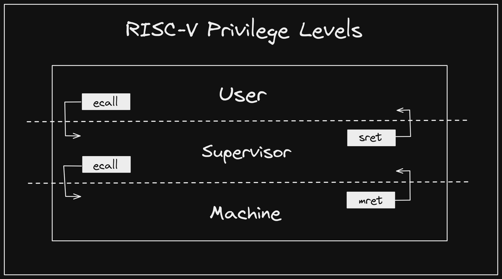

# Virtual Memory

In addition to the lectures, please use the following resources to help you with this lab:

* [RISC-V Privileged Architecture Manual](https://github.com/riscv/riscv-isa-manual)
* ["RISC-V Bytes: Privilege Levels" by Daniel Mangum](https://danielmangum.com/posts/risc-v-bytes-privilege-levels/)

## Privilege

RISC-V has functionality for "privilege modes". Depending on the privilege mode a program is in, certain functionalities or memory addresses can be enabled or disabled. This is a summary of the privilege modes:

* Machine-mode: Highest privilege, all memory addresses are enabled. Used by bootloader.
* Supervisor-mode: All addresses except user addresses are enabled. Used by OS.
* User-mode: Lowest privilege, only user addresses can be accessed. Used by programs.

A core will always start in M-mode, which does not support virtual memory. To enable virtual memory, OS must lower the privilege to either S-mode or U-mode. This is demonstrated in [`"programs/vm/os.S"`](https://github.com/sifferman/labs-with-cva6/blob/main/programs/vm/os.S) and [`"programs/vm/privilege.S"`](https://github.com/sifferman/labs-with-cva6/blob/main/programs/vm/privilege.S).

## Provided OS Explanation

You have been provided a simple Bootloader and OS: [`"programs/vm/os.S"`](https://github.com/sifferman/labs-with-cva6/blob/main/programs/vm/os.S). It is an example of how to set up and enable a page table, and lower the privilege to U-mode.

These are the steps it takes in more detail:

1. **Run bootloader in M-mode**
2. Set up the page table
3. Configure PMP
4. **Jump to the OS in S-mode**
5. Enable virtual memory using the page table
6. Add the user program to the page table
7. Load the user program to user memory
8. **Jump to the program in U-mode**
9. [`"rvfi_tracer.sv"`](https://github.com/openhwgroup/cva6/blob/ed56dfd77dd977de747947b99714f88b4c4c1300/corev_apu/tb/rvfi_tracer.sv#L74-L77) hits a breakpoint at `ecall` and exits the simulation

Note, out of simplicity's sake, there are a few important OS features that have not been fully implemented, such as:

* The code does not implement trap handlers for `ecall` instructions.
* The kernel and each user process should have its own page table.
* User processes are usually loaded to addresses 0x0-0x7fffffff.

In this lab, you will be implementing basic trap handlers.

## Prelab

You will need the [RISC-V Privileged Architecture Manual](https://github.com/riscv/riscv-isa-manual) to answer some of these questions.

1. What is the purpose of virtual memory?
2. Define the following: MMU, PTW, TLB.
3. What is the benefit of a multi-layer page table?
4. For Sv39, give
    1. The number of bits in a VA
    2. The number of bits in a PA
    3. The number of layers a PT can be
    4. The size of a page in bytes
    5. The size of a PTE
5. Complete the following page table entry questions.
    1. Provide a diagram of a Sv39 PTE.
    2. List and define the 9 bottom bits of a Sv39 page table entry.
    3. In [`"programs/vm/os.S"`](https://github.com/sifferman/labs-with-cva6/blob/main/programs/vm/os.S), each PTE's bottom 9 bits are set to either `0x1`, `0xef`, or `0xff`; explain the purposes of each of these three values.
6. Draw a diagram of the hierarchical page table created in the provided code.
7. In [`"programs/vm/os.S"`](https://github.com/sifferman/labs-with-cva6/blob/main/programs/vm/os.S) and [`"programs/vm/privilege.S"`](https://github.com/sifferman/labs-with-cva6/blob/main/programs/vm/privilege.S), several control/status registers are written. For each of the registers, provide a screenshot of the bit diagram, and a definition of each of any fields that the provided programs use. (For example, [`"programs/vm/os.S"`](https://github.com/sifferman/labs-with-cva6/blob/main/programs/vm/os.S) only uses the `SUM` from `sstatus`, so `SUM` is the only field you need to give a definition of for `sstatus`).
    1. `mstatus`
    2. `sstatus`
    3. `mepc`
    4. `sepc`
    5. `mtvec`
    6. `stvec`
    7. `satp`

## Lab

The current simulation runs just one user process, then stops the simulation once the `ecall` is run in the user program. However, we want to modify it to run 2 user processes sequentially, then stop the simulation if an `ecall` is run in M-mode. To achieve this, we need to modify the CVA6 testbench, and modify the provided OS code.

### CVA6 Testbench Modification

The CVA6 testbench is currently configured that any `ecall` instruction will stop the simulation. Edit this in [`"rvfi_tracer.sv"`](https://github.com/openhwgroup/cva6/blob/ed56dfd77dd977de747947b99714f88b4c4c1300/corev_apu/tb/rvfi_tracer.sv#L74) so that it only exits the simulation on an `ecall` in M-mode. (Hint: [`"rvfi_pkg.sv"`](https://github.com/openhwgroup/cva6/blob/master/corev_apu/tb/rvfi_pkg.sv), [`"riscv_pkg.sv"`](https://github.com/openhwgroup/cva6/blob/56ecad1aced6eb6083b9fbd216486561cca8b42c/core/include/riscv_pkg.sv#L56))

### OS Modification

0. *Same initial setup...*
1. Create `m_trap` and `s_trap` trap handlers that are assigned to `mtvec` and `stvec`
2. Create a counter that specifies which user program should be run (initialized to 1)
3. Load user program 1 to memory and configure the page table accordingly
4. Run user program 1 that has an `ecall` instruction
5. Return to the `s_trap` trap handler
6. Have `s_trap` increment the user program counter, then return to the OS with `mret`
7. Load user program 2 to a different VA and PA than user program 1, and configure the page table accordingly
8. Run user program 2 that has an `ecall` instruction
9. Return to the `s_trap` trap handler
10. Have `s_trap` increment the user program counter, then return to the OS with `mret`
11. On user program counter > 2, the OS runs `ecall`
12. Return to the `m_trap` trap handler
13. Have `m_trap` run `ecall` to exit the simulation

*Note: reference [`"programs/vm/privilege.S"`](https://github.com/sifferman/labs-with-cva6/blob/main/programs/vm/privilege.S) to help you set up your trap handlers.*

### CVA6 Trace Log

CVA6 simulations create a log file: `"cva6/trace_hart_00.dasm"`. For every instruction that the simulation ran, it shows the cycle number, VPC, privilege mode, and instruction. It will be a very useful reference for this lab.

Notes:

* *"Hart" means hardware thread, which is the same thing as a core.*
* *Sometimes the core randomly enters Debug mode. As long as the core returns to normal execution, you can ignore this. If the simulation never exits, then your code has a bug.*

### Lab Questions

1. Show your modifications to `"rvfi_tracer.sv"`.
2. Show your modifications to `"os.S"`.
3. Provide your `"trace_hart_00.dasm"` file, and highlight the following behaviors:
    1. Enter `bootloader` in M-mode
    2. Enter `OS` in S-mode
    3. Enter user program 1 in U-mode; also provide its virtual and physical address
    4. Enter `s_trap` in S-mode
    5. Renter `OS` in S-mode
    6. Enter user program 2 in U-mode; also provide its virtual and physical address
    7. Renter `s_trap` in S-mode
    8. Renter `OS` in S-mode
    9. Enter `m_trap` in M-mode
    10. Exit
4. Provide a screenshot of a waveform demonstrating how the MMU translates the user program's virtual address to its physical address.
